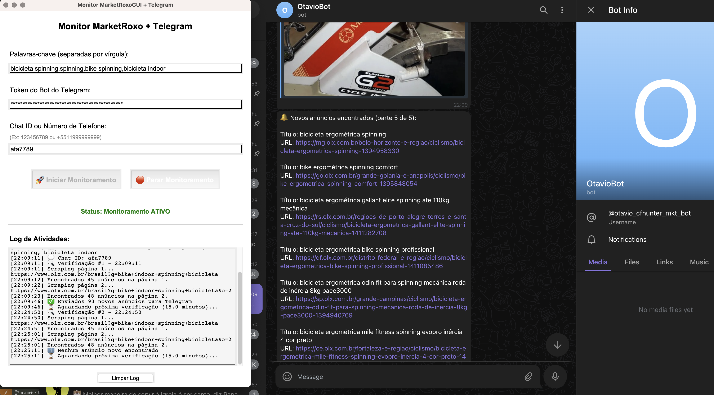
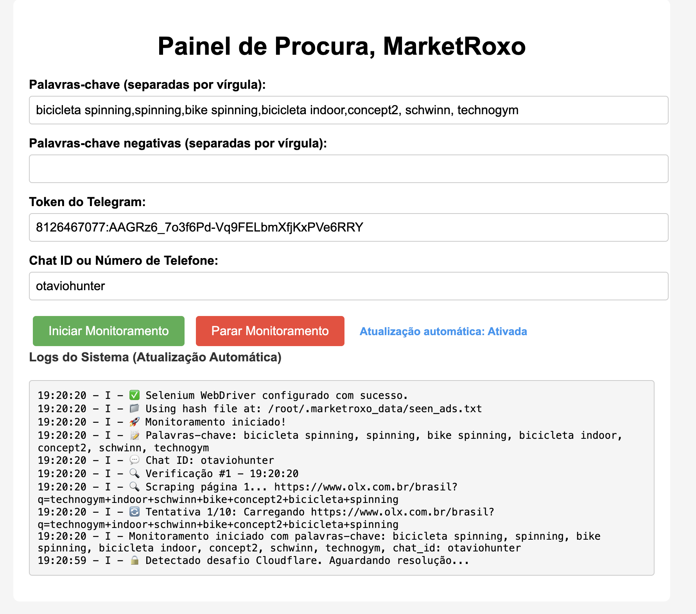

# 🛒 Marketplace Scraper Program

> **Disclaimer:** This program was developed **for educational purposes only**. It is not intended for commercial use or profit. The main goal is to demonstrate a technology to friends who are currently learning.

---

## 📁 Project Structure

```bash
.
├── gui.py                 # Graphical user interface (Tkinter)
├── main.py                # Entry point (integrates all modules)
├── monitor.py             # Background monitoring logic
├── requirements.txt       # Requirements to install python packages easier
├── scraper.py             # MarketRoxo scraping .
├── scraper_cloudflare.py  # Scraping but cloudflare does not block me.
├── server.py              # Server, to host in a VPS instead of GUI locally
└── telegram_bot.py        # Sends messages via Telegram
```

---

## ⚙️ How to Generate an Executable (Binary)

### using .env

do not forget to fill the .env it will crash if running `server.py`

remember to fill the .env if you don't want to have to write the same information everytime you open the app.

```bash
cp .env.example .env
```

### 1. Set up a Virtual Environment (Optional but recommended)

Use newer python (3.11)

```bash
python3 -m venv ./venv_project
source ./venv_project/bin/activate
```
<!-- python3 -m venv ./venv_otavio -->

### 2. Install Dependencies

```bash
pip install requests beautifulsoup4 tkinter pyinstaller
pip install gunicorn
pip freeze > requirements.txt
pip install -r requirements.txt
```

### 3. Generate Executable

```bash
pyinstaller --onefile --windowed main.py
```

The executable will be located in the `dist/` folder (e.g., `dist/main` on macOS/Linux or `dist/main.exe` on Windows).

Alternatively, you can use a `.spec` file if already configured:

```bash
/Users/afa/Library/Python/3.9/bin/pyinstaller main.spec
pyinstaller --windowed  --onefile  main.py
## trying to build a non tech user app:
pyinstaller --onefile --windowed --name "MarketRoxoMonitor" --add-data ".env:." main.py
```

The above build should create a dist folder, there you can copy the .app folder to another machine and it should work provided that it has same compatibility.

Otherwise better luck building it in that machine from scratch

---

### ⚠️ Warnings You Might Encounter

```bash
WARNING: The scripts macho_dump, macho_find and macho_standalone are installed in '/Users/afa/Library/Python/3.9/bin' which is not on PATH.
Consider adding this directory to PATH or use --no-warn-script-location to suppress this warning.

WARNING: The scripts pyi-archive_viewer, pyi-bindepend, pyi-grab_version, pyi-makespec, pyi-set_version and pyinstaller are installed in '/Users/afa/Library/Python/3.9/bin' which is not on PATH.
```

To fix this, consider adding the following to your shell profile (`.zshrc`, `.bashrc`, etc.):

```bash
export PATH="$PATH:/Users/afa/Library/Python/3.9/bin"
```

`find . -type f -name "*.py" -exec wc -l {} + | sort -n | awk '{print $2 ": " $1 " lines"}'`
total: 1478 lines

example output



## SERVER VERSION

fill admin values
```bash
pip install flask python-dotenv requests beautifulsoup4 # missing
python3 server.py
# in prod:
gunicorn -w 4 -b 0.0.0.0:5000 server:app
```



## Format code!
```bash
    pip install autopep8
    autopep8 --in-place --recursive .
```