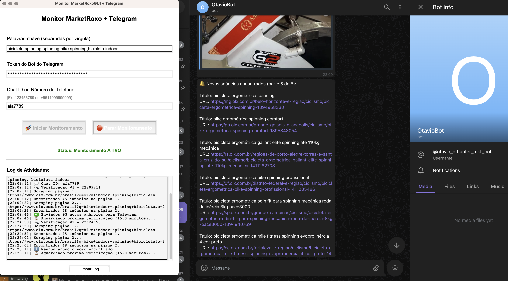

# GUI

this project was started as a gui tool but not beeing used as such anymore.

### Generate Executable

```bash
pyinstaller --onefile --windowed main.py
```

The executable will be located in the `dist/` folder (e.g., `dist/main` on macOS/Linux or `dist/main.exe` on Windows).

Alternatively, you can use a `.spec` file if already configured:

```bash
/Users/afa/Library/Python/3.9/bin/pyinstaller main.spec
pyinstaller --windowed  --onefile  main.py
## trying to build a non tech user app:
pyinstaller --onefile --windowed --name "MarketRoxoMonitor" --add-data ".env:." main.py
```

The above build should create a dist folder, there you can copy the .app folder to another machine and it should work provided that it has same compatibility.

Otherwise better luck building it in that machine from scratch

---

### ⚠️ Warnings You Might Encounter

```bash
WARNING: The scripts macho_dump, macho_find and macho_standalone are installed in '/Users/afa/Library/Python/3.9/bin' which is not on PATH.
Consider adding this directory to PATH or use --no-warn-script-location to suppress this warning.

WARNING: The scripts pyi-archive_viewer, pyi-bindepend, pyi-grab_version, pyi-makespec, pyi-set_version and pyinstaller are installed in '/Users/afa/Library/Python/3.9/bin' which is not on PATH.
```

To fix this, consider adding the following to your shell profile (`.zshrc`, `.bashrc`, etc.):

```bash
export PATH="$PATH:/Users/afa/Library/Python/3.9/bin"
```

`find . -type f -name "*.py" -exec wc -l {} + | sort -n | awk '{print $2 ": " $1 " lines"}'`
total: 1478 lines

example output


we were `pip installing from requirements`, this is deprecated, and it's here only for future reference if needed. 